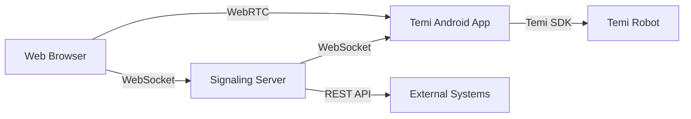

# Temi Robot Remote Control System

A comprehensive WebRTC-based live streaming and remote control system for Temi robots, featuring real-time video streaming, movement controls, speech synthesis, navigation, and location management.

## 🚀 Features

### Core Functionality
- **Live Video Streaming**: Real-time WebRTC video feed from Temi's camera
- **Remote Movement Control**: Complete directional movement with keyboard and touch controls
- **Head Tilt Control**: Precise head tilt adjustment (-25° to +55°)
- **Speech Synthesis**: Send text-to-speech commands to the robot
- **Location Management**: Save, navigate to, and manage robot locations
- **Emergency Controls**: Immediate stop functionality for safety

### Advanced Features
- **Responsive Web Interface**: Works on desktop, tablet, and mobile devices
- **Auto-reconnection**: Robust connection handling with automatic retry
- **Health Monitoring**: Server status and robot health endpoints
- **REST API**: External integration capabilities

## 📋 Prerequisites

### Hardware Requirements
- **Temi Robot** with SDK 1.136.0 or later
- **Android Development Environment**
- **Network Connection** (WiFi recommended for stability)

### Software Requirements
- **Node.js** (v14 or later)
- **Android Studio** (latest version)
- **ADB (Android Debug Bridge)**
- **ngrok** (for public exposure) or alternative tunneling service

### Required Permissions
The Android app requires the following permissions:
- Camera access
- Microphone access
- Internet access
- Network state access
- WiFi state access

## 🛠️ Installation & Setup

### 1. Temi Robot Configuration

1. **Configure Network Port:**
   - In developer settings, open the designated port for ADB connections
   - Ensure Temi is connected to the same WiFi network as your development machine

### 2. Server Setup

1. **Clone/Download the project files:**
   ```bash
   # Ensure you have the following files:
   # - signaling-server.js
   # - index.html (in public/ directory)
   ```

2. **Install Node.js dependencies:**
   ```bash
   npm install ws express
   ```

3. **Start the signaling server:**
   ```bash
   node signaling-server.js
   ```
   
   The server will start on port 3000 by default. You should see:
   ```
   Enhanced Signaling Server running on port 3000
   Web viewer: http://localhost:3000
   Health check: http://localhost:3000/health
   ```

### 3. Public Exposure Setup

#### Option A: Using ngrok (Quick but less stable)
1. **Install ngrok:**
   ```bash
   # Download from https://ngrok.com/
   npm install -g ngrok
   ```

2. **Expose your server:**
   ```bash
   ngrok http 3000
   ```

3. **Copy the generated URL:**
   ```
   Example: https://abc123.ngrok-free.app
   WebSocket URL: wss://abc123.ngrok-free.app
   ```

#### Option B: Alternative Tunneling Services

### 4. Android App Setup

1. **Open the project in Android Studio:**
   - Import the project 'Temi Stream & Control' containing `MainActivity.java` 
   - Ensure Android SDK and build tools are updated

2. **Update WebSocket URL in MainActivity.java:**
   ```java
   // Line ~77 in MainActivity.java
   private static final String WEBSOCKET_URL = "wss://your-ngrok-url.ngrok-free.app";
   ```
   
   **Important:** 
   - Use `wss://` for HTTPS ngrok URLs
   - Use `ws://` for HTTP local URLs
   - **DO NOT** include trailing slash "/"

3. **Clean and rebuild the project:**
   ```
   Build → Clean Project
   Build → Rebuild Project
   ```

### 5. Deploy to Temi Robot

1. **Connect to Temi via ADB:**
   ```bash
   adb connect XXX.XXX.XXX.XXX
   # Replace XXX.XXX.XXX.XXX with your Temi's IP address
   ```

2. **Verify connection:**
   ```bash
   adb devices
   # Should show your Temi device
   ```

3. **Install the app:**
   - Through Android Studio: Click "Run" with Temi selected as target device
   - Or via command line:
   ```bash
   adb install app-release.apk
   ```

## 🎮 Usage Instructions

### Starting the System

1. **Start the signaling server:**
   ```bash
   node signaling-server.js
   ```

2. **Set up public access:**
   ```bash
   ngrok http 3000
   ```

3. **Open the web interface:**
   - Navigate to your ngrok URL in a web browser
   - Update the WebSocket URL in the web interface if needed
   - Click "Update URL" to connect
  
4. **Launch the Android app on Temi robot**

## 📡 API Endpoints

The signaling server provides several REST API endpoints:

### Health & Status
```http
GET /health
# Returns server status, connections, and robot status

GET /robot/status
# Returns current robot status and position

GET /stats
# Returns usage statistics and command history
```

### Robot Control
```http
POST /robot/emergency-stop
# Immediately stops robot movement

POST /robot/command
Content-Type: application/json
{
  "command": "speak",
  "params": {
    "text": "Hello from API"
  }
}
# Send commands to robot via REST API
```

### Command History
```http
GET /robot/commands?limit=50
# Get recent command history (default 50 commands)
```

## 🔧 Configuration Options

### Server Configuration
Edit `signaling-server.js` to customize:
- **Port**: Change `PORT` environment variable (default: 3000)
- **Command History**: Modify command storage limit (default: 100)
- **Reconnection**: Adjust timeout and retry settings

### Android App Configuration
Edit `MainActivity.java` for:
- **WebSocket URL**: Update `WEBSOCKET_URL` constant
- **Video Quality**: Modify capture resolution (default: 1280x720@30fps)
- **Movement Speed**: Adjust speed parameters in movement methods
- **Tilt Limits**: Modify `MIN_TILT_ANGLE` and `MAX_TILT_ANGLE`

### Web Interface Configuration
Edit `index.html` for:
- **Default WebSocket URL**: Update `WEBSOCKET_URL` variable
- **Reconnection Settings**: Modify retry attempts and delays
- **UI Theme**: Customize CSS styling and colors

## 🔍 Troubleshooting

### Common Issues

#### Connection Problems
```
❌ "Robot not connected"
✅ Solutions:
   - Verify Temi is on same WiFi network
   - Check WebSocket URL is correct (wss:// for HTTPS, ws:// for HTTP)
   - Ensure no trailing slash in URL
   - Restart the Android app on Temi
   - Check ngrok tunnel is active
```

#### Video Stream Issues
```
❌ "Video not loading"
✅ Solutions:
   - Check camera permissions on Temi
   - Verify WebRTC connection in browser console
   - Test with different browser (Chrome recommended)
   - Check network firewall settings
```

#### Movement Command Failures
```
❌ "Commands not working"
✅ Solutions:
   - Ensure robot is in ready state
   - Check data channel connection status
   - Verify no movement restrictions on robot
   - Check robot's obstacle detection sensors
```

#### ngrok Disconnections
```
❌ "Frequent disconnections"
✅ Solutions:
   - Use ngrok Pro for stable connections
   - Consider alternative tunneling (Cloudflare Tunnel)
   - Deploy to cloud hosting (AWS, Google Cloud, etc.)
   - Use VPS with static IP
```

### Advanced Troubleshooting

#### Check Server Health
```bash
curl http://localhost:3000/health
# Should return JSON with connection status
```

#### Monitor WebSocket Connection
```javascript
// In browser console
console.log("WebSocket state:", ws.readyState);
// 0=CONNECTING, 1=OPEN, 2=CLOSING, 3=CLOSED
```

#### View Command History
```bash
curl http://localhost:3000/robot/commands?limit=10
# Shows recent robot commands
```

#### Android Debugging
```bash
# View Android logs
adb logcat | grep TemiStream

# Check app installation
adb shell pm list packages | grep temistream
```

## 🛡️ Security Considerations

### Network Security
- Use HTTPS/WSS in production environments
- Implement authentication for web interface
- Restrict access to trusted networks
- Use VPN for remote access

### Robot Safety
- Always test emergency stop functionality
- Set appropriate movement speed limits
- Implement collision detection overrides
- Monitor robot status continuously

## 🔄 Deployment Alternatives

### For Production Use

#### Cloud Hosting Options
1. **AWS EC2/Lightsail**: Deploy server on AWS with static IP
2. **Google Cloud Platform**: Use Cloud Run or Compute Engine
3. **DigitalOcean**: Simple VPS hosting
4. **Heroku**: Easy deployment with built-in HTTPS

#### Self-Hosted Solutions
1. **Raspberry Pi**: Local dedicated server
2. **Home Server**: Dedicated machine with port forwarding
3. **Docker**: Containerized deployment

#### Stable Tunneling Services
1. **Cloudflare Tunnel**: Free, stable, with custom domains
2. **Tailscale**: Secure network for remote access
3. **ZeroTier**: Virtual network solution

## 📱 Mobile App Improvements

### Background Operation
To prevent disconnections when app goes to background:

1. **Add to AndroidManifest.xml:**
   ```xml
   <uses-permission android:name="android.permission.WAKE_LOCK" />
   <uses-permission android:name="android.permission.FOREGROUND_SERVICE" />
   ```

2. **Implement Foreground Service:**
   - Create a service to maintain WebSocket connection
   - Use notification to keep service alive
   - Handle connection recovery automatically

3. **Power Management:**
   - Request battery optimization exemption
   - Use partial wake locks during streaming
   - Implement connection heartbeat mechanism

## 🧪 Testing

### System Testing Checklist
- [ ] WebSocket connection establishment
- [ ] Video stream quality and latency
- [ ] All movement commands (forward, backward, left, right, turns)
- [ ] Head tilt functionality (full range)
- [ ] Speech synthesis
- [ ] Location saving and navigation
- [ ] Emergency stop functionality
- [ ] Reconnection after network interruption
- [ ] Mobile device compatibility
- [ ] Multi-user handling

### Performance Testing
- **Latency**: Test command response times
- **Bandwidth**: Monitor video stream quality
- **Reliability**: Long-duration connection stability
- **Battery**: Monitor robot power consumption during streaming

## 🤝 Contributing

### Development Guidelines
- Follow Android coding standards for Java files
- Use ES6+ standards for JavaScript
- Maintain responsive design principles
- Include comprehensive error handling
- Add logging for debugging purposes

### Feature Requests
- Advanced navigation planning
- Multi-robot support
- Voice command recognition
- Autonomous patrol modes
- Integration with smart home systems

### Debugging Steps
1. **Check all URLs are correctly updated**
2. **Verify network connectivity**
3. **Review server and Android logs**
4. **Test with minimal setup first**
5. **Use health check endpoints**

### Common Commands
```bash
# Restart signaling server
node signaling-server.js

# Check Temi connection
adb devices

# View real-time logs
adb logcat | grep TemiStream

# Test server health
curl http://localhost:3000/health
```

---

## 🏗️ Architecture Overview


